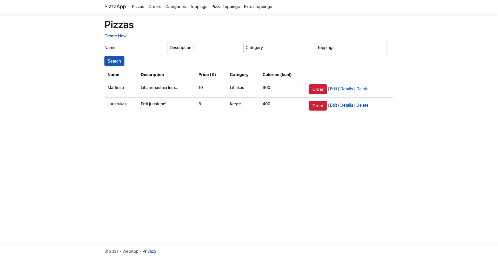
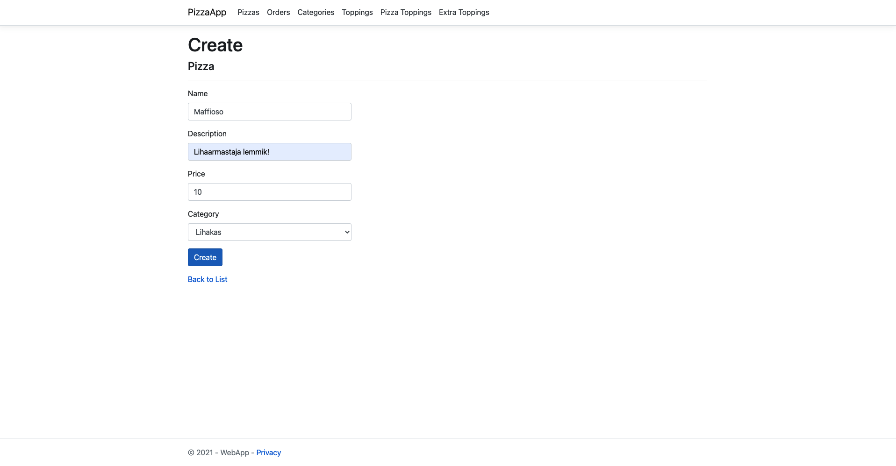
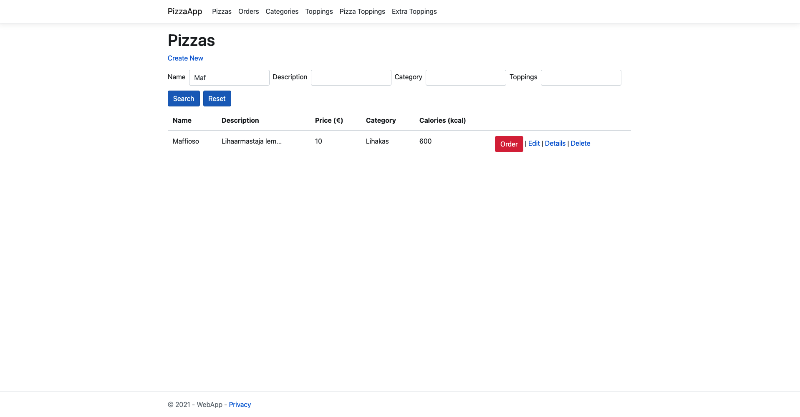
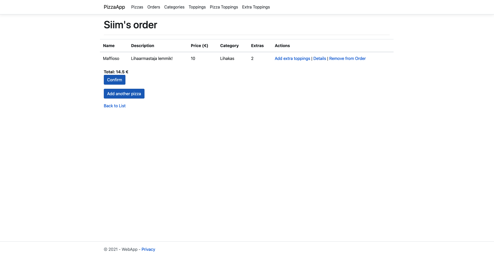
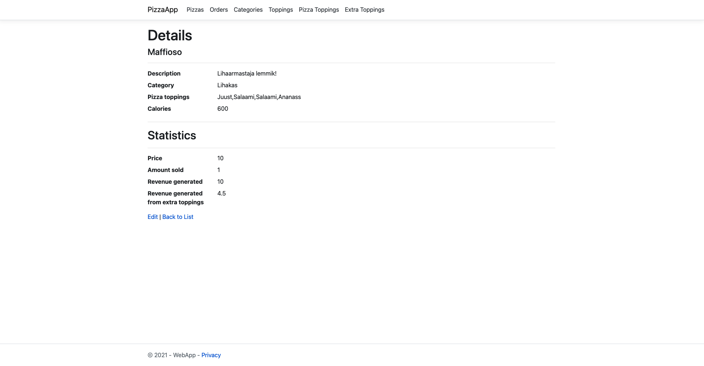

# PizzaOrderingApp

**Database migrations**

~~~
dotnet ef migrations add InitialMigration --project DAL --startup-project WebApp
dotnet ef database update  --project DAL --startup-project WebApp
~~~

**Database droping**

~~~
dotnet ef database drop  --project DAL --startup-project WebApp
~~~

## Project images

**Main Menu**

**Create a new Pizza**

**Search for pizzas**

**Ordering**

**Pizza statistics**

